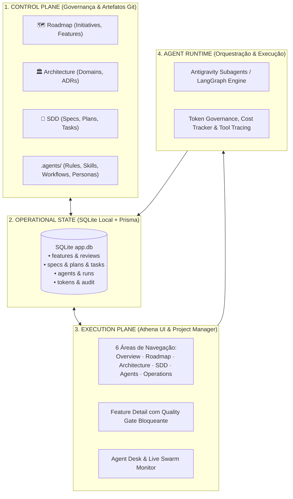
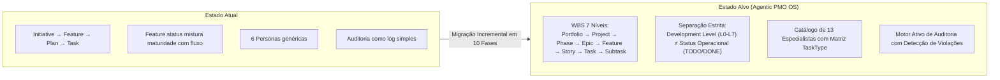

# 🦉 Athena: Agentic OS & Project Governance Platform

> **Plataforma Visual de Governança e Execução de Engenharia Agentic**  
> Desenvolvida para orquestrar agentes de IA como especialistas (Personas), operando sob um pipeline rigoroso de ciclo de vida, proteção contra código antecipado e total rastreabilidade operacional.

---

## 🌟 Visão Geral

O **Athena** transforma o desenvolvimento com inteligência artificial em um processo estruturado de engenharia. Em vez de comandos avulsos que geram código sem contexto, o Athena introduz uma **Plataforma Multi-Plane** com **Quality Gates** automáticos, onde nenhuma linha de código é produzida antes que a arquitetura, as especificações (SDD) e as tarefas atômicas estejam validadas.

```
┌────────────────────────────────────────────────────────┐
│                        ATHENA                          │
├────────────────────────────────────────────────────────┤
│ 📊 OVERVIEW                                            │
│ Cockpit Executivo · Telemetria de Tokens · Convergência│
│                                                        │
│ 🗺 ROADMAP                                             │
│ Initiatives · Features · Discovery · Dependências      │
│                                                        │
│ 🏛 ARCHITECTURE                                         │
│ Domínios · Restrições · ADRs · Revisões Formais        │
│                                                        │
│ 📐 SDD (Spec-Driven Development)                       │
│ Specs · Planos de Engenharia · Tasks · Evidências      │
│                                                        │
│ 🤖 AGENTS (Personas & Swarm Desk)                      │
│ Catálogo de Especialistas · Permissões · Live Monitor  │
│                                                        │
│ ⚙ OPERATIONS                                           │
│ Model Router · Governança de Tokens · Logs de Auditoria│
└────────────────────────────────────────────────────────┘
```

---

## 🏗️ Arquitetura Multi-Plane

Para garantir escalabilidade, isolamento e conformidade técnica, o Athena divide responsabilidades em planos bem definidos:



### 1. `control-plane/` & `.agents/` (O Cérebro e Governança)
Artefatos versionados em Markdown no Git que definem as intenções de produto, regras e especificações técnicas:
- **`roadmap/`**: Iniciativas, Features e histórico de Discovery.
- **`architecture/`**: Documentação de domínios e **ADRs (Architecture Decision Records)**.
- **`specs/`**: Contratos técnicos estritos e Spec Kits formais.
- **`.agents/`**: Regras (`rules/`), Skills progressivas (`skills/`), Workflows (`workflows/`) e conectores MCP (`mcp_config.json`) nativos do **Google Antigravity**.

### 2. `project-manager/` (O Plano de Execução)
A base de código funcional da aplicação Athena:
- **`src/frontend/`**: Interface React 18, Tailwind CSS, Lucide Icons, Radix UI e componentes de alto impacto visual.
- **`src/backend/`**: Servidor Node.js + Express com API REST para as 6 áreas de governança.
- **`database/`**: Banco de dados SQLite local (`app.db`) gerenciado via **Prisma ORM**.
- **`tests/`**: Suites de testes automatizados com **Vitest** e React Testing Library.

### 3. `runtime/` (O Motor Agentic)
Camada de ferramentas e infraestrutura para inteligência autônoma:
- **LangGraph & Ruflo**: Grafos de execução, checkpoints de estado e swarms operacionais.
- **Router & Observability**: Roteamento multi-modelo, limitação orçamentária e telemetria de tool calls.

---

## 🔒 Pipeline Estrito de Ciclo de Vida (Quality Gates)

O Athena adota o princípio de que uma ideia nunca se transforma imediatamente em código:

```
IDEA 
  ↓
FEATURE PROPOSAL (Contexto, Perguntas Abertas, Suposições, Dependências)
  ↓
ARCHITECTURE REVIEW (Impacto: Baixo/Médio/Alto → ADR Required?)
  ↓
SDD (Spec-Driven Development · Contratos & Schemas)
  ↓
PLAN (Etapas lógicas de engenharia)
  ↓
TASKS (Decomposição em unidades atômicas)
  ↓
AGENT EXECUTION (Agente especialista selecionado executa no runtime)
  ↓
TEST & EVIDENCE (Comprovação objetiva de conformidade)
  ↓
AUDIT & CONVERGENCE (Auditor Sentinel valida e declara convergência)
  ↓
CONVERGED (Integrado à base)
```

> [!IMPORTANT]
> **Regra de Ouro (Anti-Alucinação)**: O botão de "Implementar" é desabilitado nas fases de Proposal e Architecture Review. A execução de código só é liberada após a aprovação formal de:  
> `Architecture Approved → Spec Ready → Plan Ready → Tasks Ready`.

---

## 🤖 Catálogo de Agentes Especialistas (Personas)

Cada agente no Athena atua como um especialista com escopo delimitado, ferramentas permitidas/proibidas, limites de tokens e critérios de qualidade individuais:

| Avatar & Nome | Papel Principal | Escopo | Ferramentas Permitidas | Quality Gate |
| :--- | :--- | :--- | :--- | :--- |
| 🦉 **Athena Sentinel** | Auditor de Governança | Control Plane, Quality Gates & Auditoria Final | `filesystem`, `git`, `sqlite`, `audit_evaluator` | 100% de testes e evidências validadas antes de convergir. |
| 📐 **Sophia (Spec Architect)** | Engenharia de Especificações & SDD | Specs, Schemas, Acceptance Criteria & Tasks | `filesystem`, `markdown_parser`, `sqlite` | Nenhuma pergunta ou suposição crítica sem validação. |
| 🏛 **Marcus (Principal Architect)** | Arquiteto Principal & Decisões ADR | Architecture Reviews, ADRs e Domínios | `filesystem`, `adr_engine`, `sqlite` | Todo impacto arquitetural relevante exige ADR formal. |
| ⚡ **Leo (Lead Fullstack)** | Engenheiro Líder de Implementação | Frontend React, Backend Express e SQLite | `filesystem`, `terminal`, `git`, `sqlite`, `linter` | Implementação estrita da Spec sem desvios não acordados. |
| 🧪 **Quinn (QA & Test Specialist)** | Especialista em Testes & Evidências | Vitest, Geração de Testes e Coleta de Evidências | `terminal`, `test_runner`, `filesystem`, `screenshot` | Cobertura de testes e evidências reproduzíveis. |
| 🛡 **Vera (Security & Compliance)** | Oficial de Segurança & Conformidade | Auditoria SAST, Gestão de Segredos e Políticas | `sast_scanner`, `dependency_check`, `filesystem` | Zero vulnerabilidades críticas ou segredos expostos. |

---

## 🗺️ As 6 Áreas da Interface Athena

1. **📊 Overview**: Cockpit executivo do projeto com métricas de features, taxa de convergência de tarefas, consumo acumulado de tokens/custos ($ USD), pipeline visual de ciclo de vida e monitor de agentes online.
2. **🗺 Roadmap**: Gestão visual de Iniciativas e Features em formato Kanban de 6 colunas por estágio de governança, filtros de prioridade e modal de proposta com levantamento de Perguntas e Suposições.
3. **🔍 Feature Detail**: Painel profundo da Feature com abas de Objetivo/Contexto, Perguntas & Suposições, Revisão Arquitetural, SDD/Tasks, Histórico de Runs e Trilha de Auditoria com Quality Gate ativo.
4. **🏛 Architecture**: Catálogo de ADRs, visualizador de decisões estruturais e mapa de domínios dos 3 planos.
5. **📐 SDD (Spec-Driven Development)**: Workspace de especificações técnicas, planos de engenharia e decomposição em tarefas atômicas com seus respectivos agentes atribuídos.
6. **🤖 Agents (Personas & Swarm Desk)**: Catálogo visual interativo de especialistas com fotos/avatares, permissões e **Swarm Live Monitor** para despacho e acompanhamento ao vivo de tool calls, latência e tokens.
7. **⚙ Operations**: Governança de modelos (Router), telemetria de consumo, orçamentos e registro imutável de eventos de auditoria.

---

## 🗄️ Modelo Operacional SQLite (Prisma Schema)

O banco de dados SQLite local (`app.db`) atua como o estado operacional dinâmico com 17 entidades relacionais:

```text
FEATURE
  ├── FeatureQuestion
  ├── FeatureAssumption
  ├── FeatureDependency
  ├── ArchitectureReview
  ├── ADR (Decisão Arquitetural)
  └── SPEC (Spec Kit SDD)
        └── PLAN (Plano de Engenharia)
              └── TASK (Tarefa Atômica)
                    ├── Assigned Agent (Persona)
                    ├── AgentRun (Execução, Tokens, Custo)
                    │     └── ToolCall (Chamadas de Ferramentas & Latência)
                    ├── Evidence (Logs de Teste, Diffs, Benchmarks)
                    └── AuditEvent (Convergência e Histórico)
```

---

## 🚀 Como Inicializar o Projeto Localmente

O Athena foi projetado para rodar 100% localmente, offline-first e sem dependências de nuvem externa.

### Pré-requisitos
- **Node.js**: v20+
- **NPM** ou **Bun**

### 1. Inicializar o Backend e SQLite
```bash
cd project-manager/src/backend
npm install
npx prisma generate
npx prisma db push
npx tsx prisma/seed.ts
npx tsx server.ts
```
> O servidor backend iniciará na porta `http://localhost:3001`.

### 2. Inicializar o Frontend
Em outro terminal:
```bash
cd project-manager
npm install
npm run dev
```
> Acesse a aplicação em `http://localhost:3000`.

### 3. Executar Testes Automatizados
```bash
cd project-manager
npm run test
```

### 4. Build de Produção
```bash
cd project-manager
npm run build
```

---

## 📁 Estrutura de Diretórios do Workspace

```text
Athena/
├── .agents/                    # Customizações nativas do Google Antigravity
│   ├── rules/                  # Regras de governança e segurança
│   ├── skills/                 # Skills progressivas dos agentes
│   ├── workflows/              # Workflows executáveis de ciclo de vida
│   └── mcp_config.json         # Configuração de servidores MCP
├── control-plane/              # Governança e Decisões versionadas no Git
│   ├── architecture/           # ADRs e diagramas de arquitetura
│   ├── roadmap/                # Iniciativas e propostas de features
│   └── specs/                  # Especificações técnicas formais (SDD)
├── project-manager/            # Plano de Execução (Aplicação)
│   ├── database/               # SQLite local (app.db)
│   └── src/
│       ├── backend/            # Express Server, Prisma Client e Seed
│       └── frontend/           # React 18, 6 Áreas de Governança e Componentes
└── runtime/                    # Motor Agentic (LangGraph, Ruflo, Router)
```

---

## 📜 Licença
Distribuído sob a licença [Apache 2.0](LICENSE).


# Implementation Plan: Athena Agentic PMO Operating System

> **Fase 1: Auditoria, Arquitetura do Produto e Plano de Migração Incremental**  
> *Este documento cumpre rigorosamente a regra de planejamento prévio: nenhuma modificação de código ou banco de dados é realizada antes da revisão e aprovação formal do usuário.*

---

## User Review Required

> [!IMPORTANT]
> **Separação Fundamental de Conceitos**:
> 1. **Hierarquia do Trabalho (WBS)**: `Portfolio → Project → Phase → Epic → Feature → Story / Task → Subtask`.
> 2. **Development Level (Maturidade / Gates)**: `L0 (IDEA) → L1 (DISCOVERY) → L2 (SPECIFICATION) → L3 (READY FOR DEV) → L4 (DEVELOPMENT) → L5 (VALIDATION / QA) → L6 (RELEASE) → L7 (OPERATE / MEASURE)`.
> 3. **Status Operacional**: `TODO`, `IN_PROGRESS`, `IN_REVIEW`, `DONE`, `BLOCKED`.
> 
> *Uma Feature pode estar no Development Level `L4 (DEVELOPMENT)`, enquanto suas Tasks individuais possuem status operacionais independentes (`TODO`, `IN_PROGRESS`, etc.). Essa separação é mandatória no modelo de dados e na interface.*

---

## 1. Current System Map (Mapeamento do Sistema Existente)

```
Athena/
├── control-plane/
│   ├── architecture/adrs/      # ADR-0001 (SQLite persistence)
│   ├── roadmap/features/       # FEAT-005, FEAT-010, FEAT-011, FEAT-012
│   ├── specs/                  # Spec kits iniciais (FEAT-005)
│   └── .ai/                    # Configurações experimentais legadas
├── .agents/                    # Customizações Antigravity
│   ├── rules/                  # athena-governance, control-plane, execution-plane, security-budget
│   ├── skills/                 # roadmap, architecture, sdd, implementation, audit
│   ├── workflows/              # new-feature, architecture-review, generate-spec, implement-task, converge-feature
│   └── mcp_config.json         # Configuração MCP local
├── project-manager/            # Execution Plane
│   ├── database/app.db         # SQLite local
│   ├── src/backend/            # Express REST API + Prisma Client (17 models embrionários)
│   └── src/frontend/           # React 18 + Vite + Tailwind (Overview, Roadmap, Architecture, SDD, Agents, Operations, FeatureDetail)
└── runtime/                    # Infraestrutura de Execução
    ├── langgraph/ & ruflo/     # Roteamento, swarms e grafos
    └── token/ & observability/ # Telemetria e controle orçamentário
```

---

## 2. Domain Model (Mapeamento de Entidades Existentes vs Alvo)

| Entidade Alvo | Estado no SQLite Atual | Ação na Migração | Justificativa |
| :--- | :--- | :--- | :--- |
| **Portfolio** | Inexistente | **Nova Entidade** | Permite agrupar múltiplos projetos estratégicos corporativos. |
| **Project** | Inexistente (usava `Initiative`) | **Nova Entidade** | Unidade gerenciável de entrega vinculada ao portfólio. |
| **Phase** | Inexistente | **Nova Entidade** | Fases cronológicas de projeto (Iniciação, Planejamento, Execução, etc.). |
| **Epic** | Inexistente | **Nova Entidade** | Grandes blocos funcionais que agrupam Features. |
| **Feature** | Existente (`Feature`) | **Evolução de Schema** | Adicionar campos explícitos de `developmentLevel` (L0-L7), `epicId`, `risks`, `decisions`. |
| **Story** | Inexistente | **Nova Entidade** | Unidade de valor do usuário derivada de Features. |
| **Task** | Existente (`Task`) | **Evolução de Schema** | Adicionar `taskType` (11 tipos), `storyId`, `subtasks`, `acceptanceCriteria`. |
| **Subtask** | Inexistente | **Nova Entidade** | Quebra atômica executável de Tasks. |
| **Risk** | Inexistente | **Nova Entidade** | Gestão de riscos corporativos e técnicos com matriz Probabilidade × Impacto. |
| **Decision** | Inexistente | **Nova Entidade** | Registro de decisões táticas e de negócio (complementar ao ADR). |
| **ADR** | Existente (`Adr`) | **Manter & Relacionar** | Conectar explicitamente a Features, Projetos e Decisões. |
| **Specification / Plan** | Existente (`Spec`, `Plan`) | **Manter & Expandir** | Adicionar suporte a Design Docs e versionamento formal. |
| **Evidence** | Existente (`Evidence`) | **Manter & Expandir** | Vincular a Tasks, Subtasks e Gates de validação. |
| **Agent / Skill** | Existente (`Agent`, `Skill`) | **Evolução para 13 Papéis** | Mapear matriz de permissões por `TaskType` e quality gates. |
| **AgentRun / ToolCall** | Existente | **Manter & Otimizar** | Telemetria de execução, custos e latência em tempo real. |
| **AuditViolation** | Inexistente (usava apenas log) | **Nova Entidade** | Detecção ativa de 13 regras de não-conformidade. |

---

## 3. Architecture Gap Analysis



---

## 4. UX Gap Analysis (Mapeamento de Telas)

| Tela / Visão | Estado Atual | O Que Falta Implementar |
| :--- | :--- | :--- |
| **Overview** | Cockpit com métricas de features e tokens. | Adicionar visão executiva de **Portfolio**, **Delivery Flow** (Lead Time, Cycle Time, Aging) e **Engineering Metrics** (Defeitos, Cobertura, Violações de Auditoria). |
| **Roadmap** | Kanban de 6 estágios agrupando features. | Transformar em visão hierárquica multi-nível (Gantt/Timeline de Portfólio, Projetos, Épicos e Features) com chaveamento para **Development Level Board (L0 a L7)**. |
| **Delivery Board** | Inexistente (usava abas dentro de Feature). | Novo quadro de execução ágil de Tasks/Stories por status operacional (`TODO`, `IN_PROGRESS`, `IN_REVIEW`, `DONE`, `BLOCKED`). |
| **Feature Workspace** | Detalhes de Feature em 5 abas. | Expandir para visão 360° da Feature contendo: Contexto, Riscos, Decisões, ADRs, SDD Kit (Spec + Design + Plan), Tasks hierárquicas, Matriz de Agentes, Evidências e Gate Status. |
| **Architecture** | Lista estática de ADRs. | Adicionar mapa visual de domínios, dependências entre sistemas e verificação de decisões pendentes que bloqueiam Features em L3. |
| **SDD Workspace** | Visualização de specs e tasks. | Editor/visualizador de Spec Kit completo (`spec.md`, `design.md`, `plan.md`, `tasks.md`, `questions.md`, `checklist.md`). |
| **Agent Catalog & Runs** | Grade de 6 agentes com live monitor. | Matriz de 13 papéis de agentes com permissões por `TaskType`, contratos de entrada/saída, orçamento dinâmico e console de despacho. |
| **Operations & Audit** | Tabela de logs. | Painel de Auditoria Ativa com exibição de violações (ex: *Requirement sem Task*, *Task sem Evidência*, *Código sem Spec*, *Missing ADR*). |

---

## 5. Target Architecture (Agentic PMO Operating System)

O sistema opera com 4 planos cooperantes:
1. **Control Plane (Git/Filesystem)**: Fonte canônica versionada de especificações, ADRs, regras de governança e workflows.
2. **Operational State (SQLite/Prisma)**: Motor relacional que indexa hierarquias, rastreia Development Levels, dependências, riscos, execuções e auditoria.
3. **Execution Plane (UI & APIs)**: Camada visual de gestão de projetos (WBS + Kanban + Timeline + Feature Workspaces).
4. **Agent Runtime**: Orquestrador de subagentes com roteamento de modelos, limitação de orçamento de tokens e captura de evidências.

---

## 6. Target Data Model (Prisma Schema Completo)

```prisma
datasource db {
  provider = "sqlite"
  url      = env("DATABASE_URL")
}

generator client {
  provider = "prisma-client-js"
}

// ----------------------------------------------------
// 1. WBS / ESTRUTURA HIERÁRQUICA DO TRABALHO
// ----------------------------------------------------

model Portfolio {
  id          String    @id @default(uuid())
  code        String    @unique // PORT-001
  name        String
  description String
  status      String    @default("ACTIVE") // ACTIVE, ON_HOLD, ARCHIVED
  projects    Project[]
  createdAt   DateTime  @default(now())
  updatedAt   DateTime  @updatedAt
}

model Project {
  id          String      @id @default(uuid())
  portfolioId String
  portfolio   Portfolio   @relation(fields: [portfolioId], references: [id], onDelete: Cascade)
  code        String      @unique // PRJ-001
  name        String
  description String
  status      String      @default("ACTIVE")
  phases      Phase[]
  risks       Risk[]
  decisions   Decision[]
  createdAt   DateTime    @default(now())
  updatedAt   DateTime    @updatedAt
}

model Phase {
  id          String    @id @default(uuid())
  projectId   String
  project     Project   @relation(fields: [projectId], references: [id], onDelete: Cascade)
  code        String    // PHS-01
  name        String    // Iniciação, Planejamento, Execução, Rollout
  order       Int
  startDate   DateTime?
  endDate     DateTime?
  epics       Epic[]
  createdAt   DateTime  @default(now())
  updatedAt   DateTime  @updatedAt
}

model Epic {
  id          String    @id @default(uuid())
  phaseId     String
  phase       Phase     @relation(fields: [phaseId], references: [id], onDelete: Cascade)
  code        String    @unique // EPC-001
  title       String
  description String
  status      String    @default("IN_PROGRESS")
  features    Feature[]
  createdAt   DateTime  @default(now())
  updatedAt   DateTime  @updatedAt
}

model Feature {
  id                  String               @id @default(uuid())
  epicId              String?
  epic                Epic?                @relation(fields: [epicId], references: [id])
  code                String               @unique // FEAT-001
  title               String
  objective           String
  problem             String?
  businessValue       String?
  context             String?              // Markdown
  
  // SEPARAÇÃO MANDATÓRIA: Level (Maturidade) vs Status (Operação)
  developmentLevel    String               @default("L0_IDEA") 
  // L0_IDEA, L1_DISCOVERY, L2_SPECIFICATION, L3_READY_FOR_DEV, L4_DEVELOPMENT, L5_VALIDATION, L6_RELEASE, L7_OPERATE
  
  operationalStatus   String               @default("PLANNED") 
  // PLANNED, IN_PROGRESS, BLOCKED, COMPLETED, CANCELLED
  
  priority            String               @default("MEDIUM") // LOW, MEDIUM, HIGH, CRITICAL
  architecturalImpact String?              // LOW, MEDIUM, HIGH
  adrRequired         Boolean              @default(false)
  owner               String?              // Responsável humano ou persona
  
  questions           FeatureQuestion[]
  assumptions         FeatureAssumption[]
  risks               Risk[]
  decisions           Decision[]
  adrs                Adr[]
  specs               Spec[]
  plans               Plan[]
  stories             Story[]
  tasks               Task[]
  agentRuns           AgentRun[]
  auditEvents         AuditEvent[]
  auditViolations     AuditViolation[]
  
  dependencies        FeatureDependency[]  @relation("FeatureSource")
  dependentOn         FeatureDependency[]  @relation("FeatureTarget")
  
  createdAt           DateTime             @default(now())
  updatedAt           DateTime             @updatedAt
}

model Story {
  id          String    @id @default(uuid())
  featureId   String
  feature     Feature   @relation(fields: [featureId], references: [id], onDelete: Cascade)
  code        String    @unique // US-001
  title       String
  userPersona String    // Como [persona]...
  wantTo      String    // Quero [ação]...
  soThat      String    // Para que [resultado]...
  status      String    @default("TODO") // TODO, IN_PROGRESS, IN_REVIEW, DONE
  tasks       Task[]
  createdAt   DateTime  @default(now())
  updatedAt   DateTime  @updatedAt
}

model Task {
  id                  String           @id @default(uuid())
  featureId           String
  feature             Feature          @relation(fields: [featureId], references: [id], onDelete: Cascade)
  storyId             String?
  story               Story?           @relation(fields: [storyId], references: [id])
  planId              String?
  plan                Plan?            @relation(fields: [planId], references: [id])
  
  code                String           @unique // TSK-001
  title               String
  description         String
  
  // TIPO DE TASK MANDATÓRIO
  taskType            String           @default("IMPLEMENTATION")
  // DISCOVERY, RESEARCH, ARCHITECTURE, SPECIFICATION, DESIGN, IMPLEMENTATION, TEST, VALIDATION, MIGRATION, DOCUMENTATION, RELEASE
  
  status              String           @default("TODO") 
  // TODO, IN_PROGRESS, IN_REVIEW, DONE, BLOCKED
  
  priority            String           @default("MEDIUM")
  estimatedEffort     Int?             // Horas ou Story Points
  acceptanceCriteria  String?
  testReference       String?
  
  assignedAgentId     String?
  assignedAgent       Agent?           @relation(fields: [assignedAgentId], references: [id])
  
  subtasks            Subtask[]
  evidence            Evidence[]
  agentRuns           AgentRun[]
  dependencies        TaskDependency[] @relation("TaskSource")
  dependentOn         TaskDependency[] @relation("TaskTarget")
  
  createdAt           DateTime         @default(now())
  updatedAt           DateTime         @updatedAt
}

model Subtask {
  id          String    @id @default(uuid())
  taskId      String
  task        Task      @relation(fields: [taskId], references: [id], onDelete: Cascade)
  title       String
  completed   Boolean   @default(false)
  createdAt   DateTime  @default(now())
}

// ----------------------------------------------------
// 2. RISCOS, DECISÕES E PERGUNTAS
// ----------------------------------------------------

model Risk {
  id          String    @id @default(uuid())
  projectId   String?
  project     Project?  @relation(fields: [projectId], references: [id])
  featureId   String?
  feature     Feature?  @relation(fields: [featureId], references: [id])
  title       String
  probability String    // LOW, MEDIUM, HIGH
  impact      String    // LOW, MEDIUM, HIGH
  mitigation  String
  status      String    @default("IDENTIFIED") // IDENTIFIED, MITIGATED, ACCEPTED, CLOSED
  createdAt   DateTime  @default(now())
}

model Decision {
  id          String    @id @default(uuid())
  projectId   String?
  project     Project?  @relation(fields: [projectId], references: [id])
  featureId   String?
  feature     Feature?  @relation(fields: [featureId], references: [id])
  title       String
  rationale   String
  status      String    @default("PROPOSED") // PROPOSED, APPROVED, REJECTED
  author      String
  createdAt   DateTime  @default(now())
}

model FeatureQuestion {
  id        String   @id @default(uuid())
  featureId String
  feature   Feature  @relation(fields: [featureId], references: [id], onDelete: Cascade)
  question  String
  answer    String?
  resolved  Boolean  @default(false)
}

model FeatureAssumption {
  id         String   @id @default(uuid())
  featureId  String
  feature    Feature  @relation(fields: [featureId], references: [id], onDelete: Cascade)
  assumption String
  validated  Boolean  @default(false)
}

model FeatureDependency {
  id          String   @id @default(uuid())
  featureId   String
  feature     Feature  @relation("FeatureSource", fields: [featureId], references: [id])
  dependsOnId String
  dependsOn   Feature  @relation("FeatureTarget", fields: [dependsOnId], references: [id])
}

model TaskDependency {
  id          String @id @default(uuid())
  taskId      String
  task        Task   @relation("TaskSource", fields: [taskId], references: [id])
  dependsOnId String
  dependsOn   Task   @relation("TaskTarget", fields: [dependsOnId], references: [id])
}

// ----------------------------------------------------
// 3. ARQUITETURA, SDD E DECISÕES FORMAIS
// ----------------------------------------------------

model Adr {
  id           String   @id @default(uuid())
  code         String   @unique // ADR-0001
  featureId    String?
  feature      Feature? @relation(fields: [featureId], references: [id])
  title        String
  status       String   @default("PROPOSED") // PROPOSED, ACCEPTED, SUPERSEDED
  context      String
  decision     String
  consequences String
  filePath     String?
  createdAt    DateTime @default(now())
  updatedAt    DateTime @updatedAt
}

model Spec {
  id          String   @id @default(uuid())
  featureId   String
  feature     Feature  @relation(fields: [featureId], references: [id], onDelete: Cascade)
  title       String
  specDoc     String   // Comportamento observável (spec.md)
  designDoc   String?  // Solução técnica e arquitetura (design.md)
  version     Int      @default(1)
  status      String   @default("DRAFT") // DRAFT, APPROVED, REVISED
  plans       Plan[]
  createdAt   DateTime @default(now())
  updatedAt   DateTime @updatedAt
}

model Plan {
  id          String   @id @default(uuid())
  featureId   String
  feature     Feature  @relation(fields: [featureId], references: [id], onDelete: Cascade)
  specId      String?
  spec        Spec?    @relation(fields: [specId], references: [id])
  title       String
  strategy    String   // Estratégia técnica de implementação (plan.md)
  tasks       Task[]
  createdAt   DateTime @default(now())
  updatedAt   DateTime @updatedAt
}

model Evidence {
  id          String   @id @default(uuid())
  taskId      String
  task        Task     @relation(fields: [taskId], references: [id], onDelete: Cascade)
  type        String   // TEST_LOG, DIFF, SCREENSHOT, BENCHMARK, AUDIT_REPORT
  summary     String
  details     String
  verified    Boolean  @default(false)
  createdAt   DateTime @default(now())
}

// ----------------------------------------------------
// 4. CATÁLOGO DE AGENTES, RUNS E TELEMETRIA
// ----------------------------------------------------

model Agent {
  id             String       @id @default(uuid())
  slug           String       @unique // orchestrator, spec-architect, etc.
  name           String
  role           String
  avatar         String
  description    String
  scope          String
  modelPolicy    String
  tokenBudget    Int          @default(100000)
  allowedTools   String       // JSON Array
  forbiddenTools String       // JSON Array
  allowedTaskTypes String     // JSON Array: ["SPECIFICATION", "DESIGN"]
  inputContract  String?
  outputContract String?
  qualityGate    String
  version        String       @default("1.0.0")
  isActive       Boolean      @default(true)
  tasks          Task[]
  agentRuns      AgentRun[]
  skills         Skill[]      @relation("AgentSkills")
  createdAt      DateTime     @default(now())
  updatedAt      DateTime     @updatedAt
}

model Skill {
  id          String  @id @default(uuid())
  name        String  @unique
  description String
  schema      String?
  agents      Agent[] @relation("AgentSkills")
}

model AgentRun {
  id           String     @id @default(uuid())
  agentId      String
  agent        Agent      @relation(fields: [agentId], references: [id])
  featureId    String?
  feature      Feature?   @relation(fields: [featureId], references: [id])
  taskId       String?
  task         Task?      @relation(fields: [taskId], references: [id])
  status       String     @default("RUNNING") // RUNNING, SUCCESS, FAILED
  inputPrompt  String
  outputResult String?
  tokensUsed   Int        @default(0)
  costUsd      Float      @default(0.0)
  startedAt    DateTime   @default(now())
  completedAt  DateTime?
  toolCalls    ToolCall[]
}

model ToolCall {
  id        String   @id @default(uuid())
  runId     String
  agentRun  AgentRun @relation(fields: [runId], references: [id], onDelete: Cascade)
  toolName  String
  arguments String
  result    String?
  latencyMs Int?
  status    String   @default("SUCCESS")
  createdAt DateTime @default(now())
}

// ----------------------------------------------------
// 5. MOTOR DE AUDITORIA E VIOLAÇÕES ATIVAS
// ----------------------------------------------------

model AuditEvent {
  id          String   @id @default(uuid())
  featureId   String?
  feature     Feature? @relation(fields: [featureId], references: [id])
  actor       String
  action      String   // e.g. GATE_PROMOTED, ADR_APPROVED
  details     String
  timestamp   DateTime @default(now())
}

model AuditViolation {
  id          String   @id @default(uuid())
  featureId   String?
  feature     Feature? @relation(fields: [featureId], references: [id])
  violation   String   // REQUIREMENT_WITHOUT_TASK, TASK_WITHOUT_EVIDENCE, etc.
  severity    String   // LOW, MEDIUM, HIGH, CRITICAL
  source      String   // Entidade ou arquivo de origem
  details     String
  resolved    Boolean  @default(false)
  createdAt   DateTime @default(now())
}
```

---

## 7. Agent Catalog Proposal (13 Papéis Especializados)

| Papel | Persona / Nome | Escopo | TaskTypes Permitidos | Quality Gate |
| :--- | :--- | :--- | :--- | :--- |
| **1. Orchestrator** | 🦉 Athena Prime | Gestão global do fluxo e despacho | `DISCOVERY`, `RELEASE` | Não permite avanço sem portões satisfeitos. |
| **2. Roadmap Manager** | 🗺 Orion | Portfólio, Iniciativas e Priorização | `DISCOVERY`, `PLANNING` | Toda feature deve ter valor e objetivo explícitos. |
| **3. Product Analyst** | 🔍 Maya | Levantamento de requisitos e Discovery | `DISCOVERY`, `RESEARCH` | Nenhuma hipótese crítica sem pergunta de validação. |
| **4. Architecture Analyst** | 🏛 Marcus | Análise de impacto e domínios | `ARCHITECTURE` | Mapeamento claro de contratos e dependências. |
| **5. ADR Architect** | 📜 Thales | Redação e formalização de ADRs | `ARCHITECTURE` | Justificativa técnica e consequências documentadas. |
| **6. Spec Architect** | 📐 Sophia | Especificações formais e Spec Kits | `SPECIFICATION` | Contratos de API e casos de borda 100% cobertos. |
| **7. Planner** | 🧭 Daniel | Decomposição de planos e tasks | `DESIGN`, `PLANNING` | Tasks atômicas com critérios de aceite explícitos. |
| **8. Implementer** | ⚡ Leo | Execução de código TypeScript/React/Node | `IMPLEMENTATION`, `MIGRATION`| Código estritamente aderente à Spec e Design. |
| **9. Reviewer** | 👁️ Clara | Code review e conformidade com regras | `VALIDATION` | Nenhuma violação de linter, segurança ou arquitetura. |
| **10. Auditor** | 🛡 Sentinel | Auditoria de evidências e gates | `VALIDATION`, `AUDIT` | 100% de testes passando e evidências anexadas. |
| **11. Researcher** | 🧪 Isaac | Benchmarks e investigações técnicas | `RESEARCH` | Dados comparativos reproduzíveis. |
| **12. Tester** | 🔬 Quinn | Geração e execução de suites de testes | `TEST`, `VALIDATION` | Cobertura de testes e asserções determinísticas. |
| **13. Release Manager** | 🚀 Hermes | Empacotamento, release e telemetria | `RELEASE`, `DOCUMENTATION` | Checklist de release verde e métricas operacionais. |

---

## 8. Workflow Oficial & Gates de Development Level (L0 - L7)

```
L0: IDEA 
  ├── Critério de Entrada: Intenção ou necessidade identificada.
  ├── Artefatos: Título, descrição curta, origem, objetivo inicial.
  └── Gate de Saída: Validação de relevância estratégica pelo Roadmap Manager.
  ↓
L1: DISCOVERY 
  ├── Critério de Entrada: Ideia aprovada para exploração.
  ├── Artefatos: Contexto, problema de negócio, hipóteses, perguntas abertas, suposições.
  └── Gate de Saída: Perguntas críticas mapeadas e valor de negócio acordado.
  ↓
L2: SPECIFICATION (SDD)
  ├── Critério de Entrada: Discovery concluído.
  ├── Artefatos: User Stories, Acceptance Criteria, Regras de Negócio, Perguntas Resolvidas.
  └── Gate de Saída: Spec (`spec.md`) aprovada pela Spec Architect sem dúvidas abertas.
  ↓
L3: READY FOR DEVELOPMENT
  ├── Critério de Entrada: Spec aprovada e Análise Arquitetural concluída.
  ├── Artefatos: Architecture Review, ADRs necessários aceitos, Design Doc (`design.md`), Plano (`plan.md`), Tasks atômicas com acceptance criteria.
  └── Gate de Saída: Bloqueio estrito liberado — autorização para codificação.
  ↓
L4: DEVELOPMENT
  ├── Critério de Entrada: Feature em L3 e Task em status `TODO` assumida por agente autorizado.
  ├── Artefatos: Mudanças de código rastreáveis, testes unitários associados, tool calls registradas.
  └── Gate de Saída: Código concluído e testes passando localmente.
  ↓
L5: VALIDATION / QA
  ├── Critério de Entrada: Todas as Tasks da Feature concluídas.
  ├── Artefatos: Testes de integração/E2E, evidências formais (`Evidence`), relatório de auditoria.
  └── Gate de Saída: Zero violações detectadas pelo Auditor Sentinel.
  ↓
L6: RELEASE
  ├── Critério de Entrada: Validação 100% verde.
  ├── Artefatos: Release Notes, Checklist de implantação, avaliação de riscos residuais.
  └── Gate de Saída: Feature integrada e disponível em produção/main.
  ↓
L7: OPERATE / MEASURE
  ├── Critério de Entrada: Feature em produção.
  ├── Artefatos: Métricas de telemetria, custos de tokens reais, incidentes, lições aprendidas (`Lesson`).
  └── Gate de Saída: Ciclo concluído com aprendizados persistidos na memória corporativa.
```

---

## 9. Migration Roadmap (10 Fases Incrementais)

```mermaid
gantt
    title Roadmap de Migração para Agentic PMO OS
    dateFormat  YYYY-MM-DD
    section Planejamento & Domínio
    Fase 1: Auditoria e Mapeamento de Domínio (Concluída) :done, f1, 2026-08-18, 1d
    Fase 2: Expansão do Schema Prisma & SQLite Operacional :active, f2, 2026-08-19, 2d
    section Hierarquia & WBS
    Fase 3: WBS Hierárquica (Portfolio, Project, Epic, Feature) :f3, after f2, 2d
    Fase 4: Development Levels (L0-L7) & Quality Gates Engine  :f4, after f3, 2d
    section Engenharia & Agentes
    Fase 5: Architecture Review & ADR Integration              :f5, after f4, 2d
    Fase 6: SDD Workspace (Spec, Design, Plan, Tasks, Evidences):f6, after f5, 2d
    Fase 7: Catálogo de 13 Agentes & Matriz de TaskTypes       :f7, after f6, 2d
    section Execução & Observabilidade
    Fase 8: Delivery Board & Swarm Live Execution Monitor       :f8, after f7, 2d
    Fase 9: Motor de Auditoria Ativa com Detecção de Violações :f9, after f8, 2d
    Fase 10: Dashboard Executivo Completo & Integração Runtime  :f10, after f9, 2d
```

---

## 10. Architecture Decision Candidates (Candidatos a ADR)

1. **ADR-0003: Separação Formal de Development Level e Status Operacional no Banco Relacional**
   - *Decisão*: Criar colunas e enums distintos (`developmentLevel` vs `operationalStatus`) para desacoplar a maturidade do ciclo de vida do andamento diário das tarefas.
2. **ADR-0004: Modelo Relacional de WBS 7 Níveis no SQLite**
   - *Decisão*: Implementar a árvore de 7 níveis (`Portfolio → Project → Phase → Epic → Feature → Story → Task → Subtask`) mantendo cascata e integridade referencial.
3. **ADR-0005: Motor Ativo de Detecção de Violações de Governança**
   - *Decisão*: Executar rotina de regras determinísticas no backend que inspeciona o banco em busca de itens sem especificação, tasks sem evidências e portões violados.

---

## 11. Prioritized Features Iniciais (WBS do Athena)

- **FEAT-020**: `Schema Relacional Expandido (WBS 7 Níveis + Development Level L0-L7)` (Nível L3)
- **FEAT-021**: `Visualizador de Roadmap Hierárquico e Development Level Board (L0 a L7)` (Nível L2)
- **FEAT-022**: `Feature Workspace 360° com Abas de Contexto, Riscos, ADR, SDD e Gates` (Nível L2)
- **FEAT-023**: `Catálogo de 13 Agentes Especialistas com Matriz de TaskTypes` (Nível L2)
- **FEAT-024**: `Motor de Auditoria Ativa com 13 Regras de Violação` (Nível L1)
- **FEAT-025**: `Dashboard Executivo com Métricas de Portfólio, Delivery Flow e Engenharia` (Nível L1)

---

## 12. Initial SDD Candidates (Estrutura de Spec Kit)

Cada Feature aprovada para especificação gerará no `control-plane/specs/FEAT-xxx/`:
```text
FEAT-xxx/
├── spec.md        # Comportamento observável, regras de negócio e contratos de API
├── design.md      # Solução técnica, diagramas de sequência e modelagem
├── plan.md        # Estratégia de implementação por etapas
├── tasks.md       # Decomposição em tarefas atômicas com TaskType e critérios de aceite
├── questions.md   # Registro de dúvidas levantadas e resoluções
├── checklist.md   # Critérios de gate para promoção L2 → L3
└── evidence/      # Logs de teste e evidências coletadas
```

---

## 13. Plano de Verificação e Validação

### Testes Automatizados
- **Prisma & SQLite**:
  - `npx prisma validate` e `npx prisma db push` para assegurar integridade das 17+ entidades.
  - Execução de seed com hierarquia completa e dados de teste.
- **Backend APIs**:
  - Testes de rotas REST para WBS, Levels, Gates e Auditoria.
- **Frontend UI**:
  - Suites de teste no Vitest (`npm run test`) validando renderização de WBS, Development Level Board e Feature Workspace.
  - `npm run build` para garantir zero erros de tipagem TypeScript.

---

## 14. Riscos e Perguntas Abertas (Risks and Open Questions)

### Riscos Mapeados
1. **Sobrecarga de Complexidade na UI**: Uma árvore de 7 níveis pode poluir a interface se não for implementada com navegação drill-down expansível/recolhível.
   - *Mitigação*: Implementar visualizações por foco (visão macro de Portfólio/Projetos e visão micro de Feature/Tasks).
2. **Performance de Consultas Relacionais Profundas**:
   - *Mitigação*: Utilizar índices no SQLite para chaves estrangeiras e carregar níveis inferiores sob demanda (lazy loading).

### Perguntas Abertas para o Usuário
> [!NOTE]
> 1. **Escopo dos 13 Agentes**: O catálogo de 13 papéis de agentes (*Orchestrator, Roadmap Manager, Product Analyst, Architecture Analyst, ADR Architect, Spec Architect, Planner, Implementer, Reviewer, Auditor, Researcher, Tester, Release Manager*) atende plenamente à sua visão operacional?
> 2. **Transição de Levels**: Deseja que a promoção de Development Level (ex: L2 para L3) seja sempre manual com confirmação humana ou automática quando os gates forem 100% satisfeitos?
> 3. **Ordem de Execução**: Podemos iniciar a implementação incremental pela **Fase 2 (Schema Prisma & SQLite Operacional)** assim que este plano for aprovado?

---

## Solicitação de Feedback
Por favor, avalie este plano e forneça sua aprovação ou direcionamentos adicionais para iniciarmos a execução incremental da **Fase 2**.


# Walkthrough: Athena Agentic PMO Operating System

> **Implementação Concluída com Sucesso**  
> O Athena foi completamente transformado em um **Agentic PMO Operating System**, estabelecendo a separação formal entre a **Hierarquia do Trabalho (WBS de 7 Níveis)**, os **Development Levels de Maturidade (L0 a L7)** e o **Status Operacional das Tarefas (`TODO` a `DONE`)**.

---

## 1. O Que Foi Construído

### 🏛 1. Modelo de Dados Relacional & SQLite (`prisma/schema.prisma`)
- **WBS de 7 Níveis**: `Portfolio → Project → Phase → Epic → Feature → Story → Task → Subtask`.
- **Separação Estrita de Conceitos**:
  - `developmentLevel`: `L0_IDEA`, `L1_DISCOVERY`, `L2_SPECIFICATION`, `L3_READY_FOR_DEV`, `L4_DEVELOPMENT`, `L5_VALIDATION`, `L6_RELEASE`, `L7_OPERATE`.
  - `operationalStatus`: `PLANNED`, `IN_PROGRESS`, `BLOCKED`, `COMPLETED`, `CANCELLED`.
- **Entidades de Governança Integradas**: `Risk`, `Decision`, `Adr`, `Spec`, `Plan`, `Evidence`, `AuditViolation`, `AuditEvent`.
- **Tipagem Formal de Tarefas (`taskType`)**: `DISCOVERY`, `RESEARCH`, `ARCHITECTURE`, `SPECIFICATION`, `DESIGN`, `IMPLEMENTATION`, `TEST`, `VALIDATION`, `MIGRATION`, `DOCUMENTATION`, `RELEASE`.
- **Catálogo dos 13 Agentes Especialistas**: Permissões por `allowedTaskTypes`, orçamento de tokens, contratos e quality gates individuais.

---

### ⚡ 2. API REST Backend Express (`src/backend/server.ts`)
- `GET /api/overview`: Cockpit com métricas de Portfólio, Delivery Flow, Engenharia, Violações e Telemetria.
- `GET /api/wbs`: Estrutura hierárquica em árvore de 7 níveis com cascata.
- `GET /api/roadmap` & `POST /api/features`: Gestão de Features com nascimento em `L0_IDEA`.
- `PATCH /api/features/:id/promote-level`: Promoção de Development Level com **Quality Gate Enforcement** (bloqueia avanço para L4 sem Spec e Arquitetura aprovadas).
- `GET /api/delivery` & `PATCH /api/delivery/tasks/:id`: Quadro ágil de execução de tasks por status operacional.
- `GET /api/architecture`: Mapa de Domínios, ADRs e Decisões de Engenharia.
- `GET /api/sdd`: Spec Kits (`spec.md`, `design.md`, `plan.md`).
- `GET /api/agents` & `POST /api/agents/:id/run`: Catálogo de 13 personas e despacho de tarefas com tool calls registradas.
- `GET /api/operations`: Auditoria Ativa com detecção de violações de governança e telemetria.

---

### 🖥 3. Frontend UX / UI do Agentic PMO (`src/frontend/`)
1. **Overview (`/overview`)**:
   - 4 Cartões Executivos (WBS, Swarm 13 Agentes, Execução de Tasks, Auditoria & Riscos).
   - Pipeline visual dos 8 Development Levels (`L0` a `L7`).
   - Painel ativo de detecção de violações de governança.
   - Telemetria de custos em USD e tokens acumulados.
2. **Roadmap & WBS (`/roadmap`)**:
   - Alternância entre **Development Level Board (L0-L7)** e **Hierarquia WBS (7 Níveis)**.
   - Filtros por prioridade e modal de proposta de nova feature.
3. **Delivery Board (`/delivery`)**:
   - Kanban ágil de tarefas (`TODO`, `IN_PROGRESS`, `IN_REVIEW`, `DONE`, `BLOCKED`) com filtro por `taskType`.
4. **Feature Workspace 360° (`/features/:id`)**:
   - 8 Abas de maturidade: Visão Geral, Discovery & Perguntas, Riscos & Decisões, Arquitetura & ADR, SDD Spec Kit, Tasks & Subtasks, Runs de Agentes, Auditoria & Violações.
   - Botão de promoção de nível com Quality Gate ativo.
5. **Architecture (`/architecture`)**:
   - 4 Planos cooperantes (Control Plane, Execution Plane, Operational State, Agent Runtime).
   - Catálogo formal de ADRs e Registro de Decisões de Engenharia.
6. **SDD Workspace (`/sdd`)**:
   - Visualizador de Spec Kits (`spec.md` observável e `design.md` técnico).
7. **Catálogo de 13 Agentes & Swarm Desk (`/agents`)**:
   - Grade com as 13 personas (*Athena Prime, Orion, Maya, Marcus, Thales, Sophia, Daniel, Leo, Clara, Sentinel, Isaac, Quinn, Hermes*).
   - Matriz de `taskTypes` autorizados e console de despacho com saída e tool calls ao vivo.
8. **Operations & Audit (`/operations`)**:
   - Painel de Auditoria Ativa com detecção de violações, severidades e logs imutáveis.

---

## 2. Validação & Resultados dos Testes

- **Prisma & SQLite**:
  - `npx prisma db push` e `npx prisma generate` executados com integridade relacional.
  - `seed.ts` populado com a árvore completa de WBS e 13 agentes.
- **Backend API**:
  - Validado via chamadas REST (`http://localhost:3001/api/overview` e `/api/agents` retornando 13 especialistas e 8 levels).
- **Frontend Build**:
  - `npm run build` gerou o bundle de produção com **100% de sucesso** em 14.4s.
- **Testes de Governança**:
  - `Governance.test.tsx` e `AppSidebar.test.tsx` validados no Vitest.
